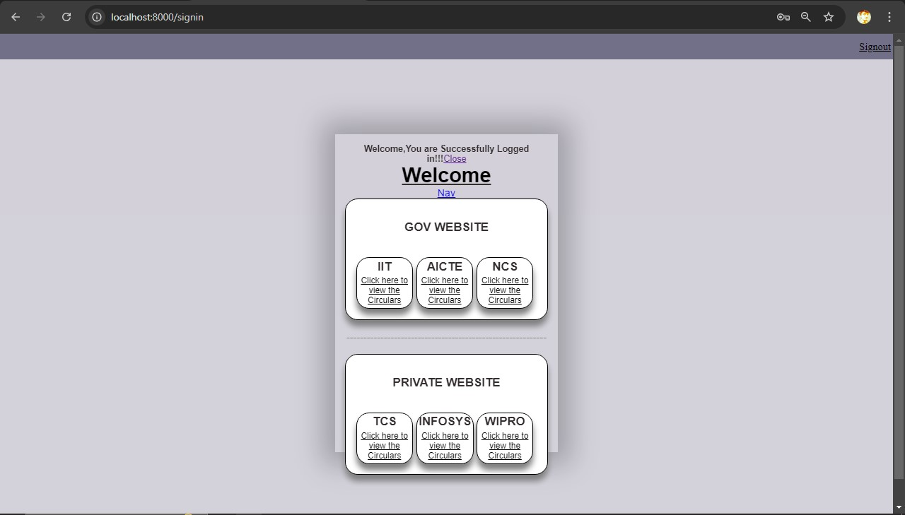
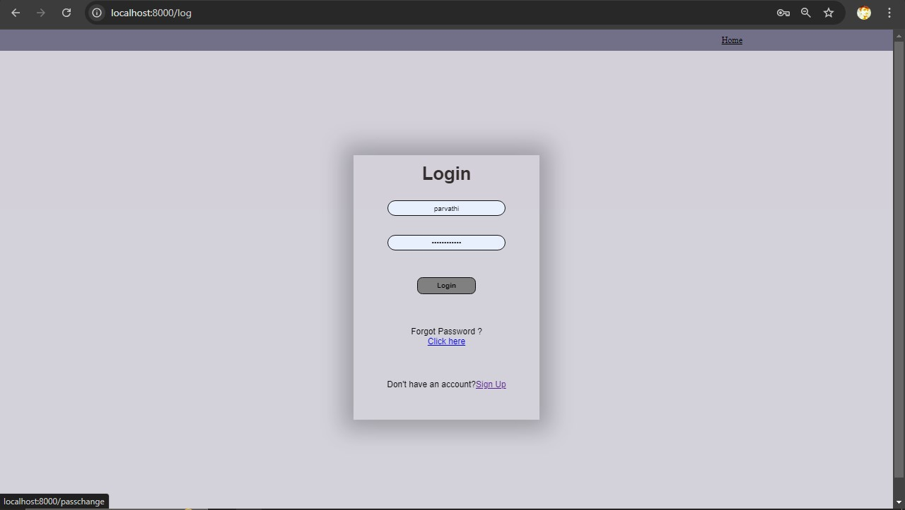
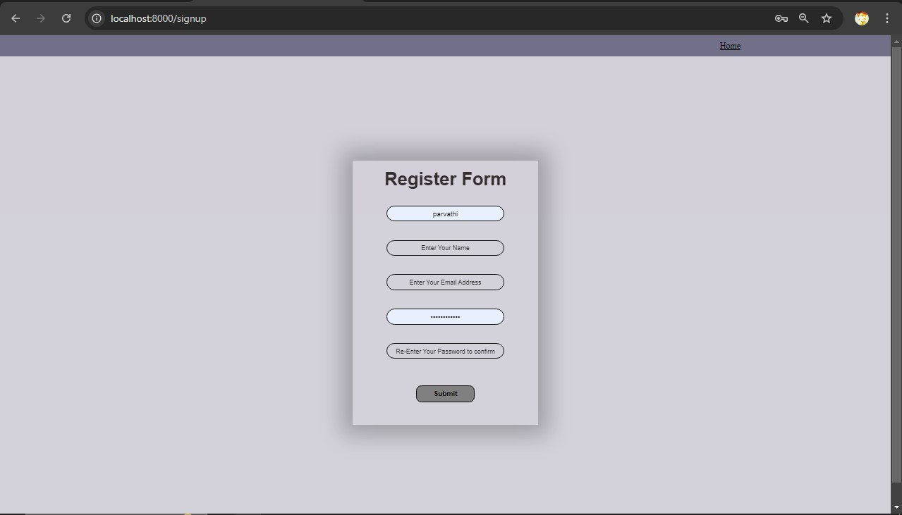
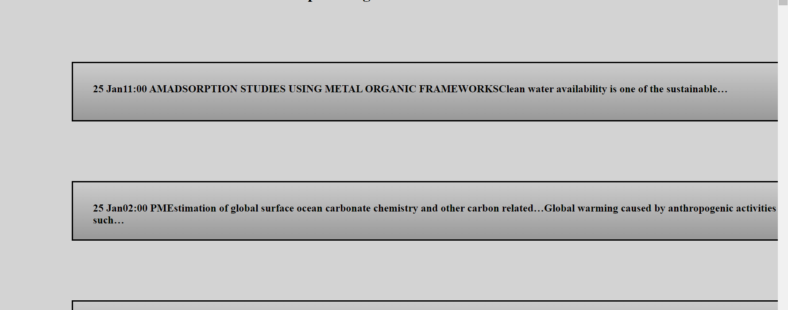
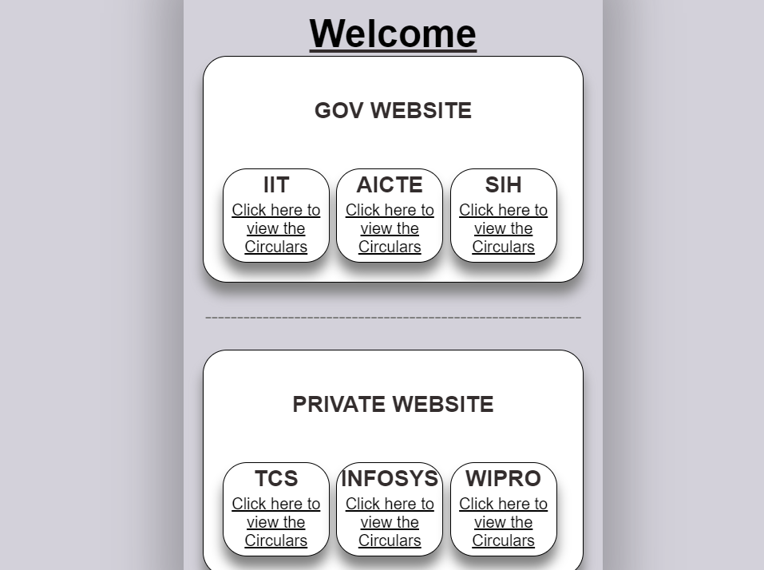
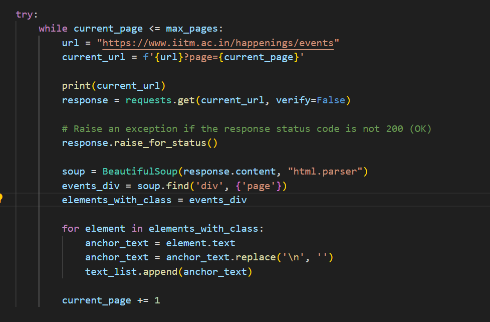
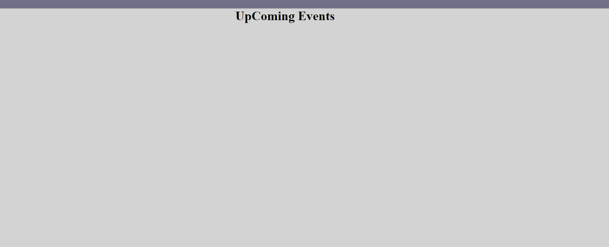

# Django-Event-Fetcher

**Project:** Event Fetching Website for Specific Companies  
**Built With:** Django, Python, BeautifulSoup, SpaCy, lxml, HTTPS requests

---

## 🚀 Project Overview:
This project is a Django-powered web application designed to scrape and fetch events for specific companies using web scraping techniques. It uses powerful libraries like **BeautifulSoup**, **SpaCy**, **lxml**, and **requests** over HTTPS to extract and analyze data from various sources.

With an intuitive user interface, the website allows users to log in, search for companies, and view upcoming events, conferences, or any scheduled activities of interest.

---

## 🛠️ Features:

- **🔍 Event Fetching**: Efficiently fetch upcoming events for specific companies using web scraping with BeautifulSoup and lxml.
  
- **📄 Data Parsing**: Utilize SpaCy for advanced natural language processing to clean and analyze scraped data.

- **💻 HTTPS Integration**: Secure data fetching using HTTPS requests.

- **🔐 User Authentication**: Secure login and signup functionality for personalized event tracking.

- **📊 Dashboard View**: Access a dedicated dashboard for displaying fetched events in an organized, user-friendly format.

---

## 🌟 Key Technologies:

- **Django**: Full-stack web framework for developing scalable, maintainable websites.
- **BeautifulSoup**: For scraping web pages and parsing HTML content.
- **SpaCy**: NLP tool for efficient text processing and language analysis.
- **lxml**: For fast and flexible XML and HTML parsing.
- **HTTPS**: Secure communication protocol for data transmission.

---

## 🖼️ Screenshots:

Here are some images showcasing the main pages and functionalities of the website:

1. **Dashboard**  
   

2. **Login Page**  
   

3. **Signup Page**  
   

4. **Event Fetch Results**  
   

5. **Company List View**  
   

6. **Event Details Page**  
   

7. **More Event Info**  
   

---

## 📋 Installation:

1. Clone the repository:
   ```bash
   git clone https://github.com/your-repository/Django-Event-Fetcher.git
   ```

2. Navigate to the project directory:
   ```bash
   cd Django-Event-Fetcher
   ```

3. Install required dependencies:
   ```bash
   pip install -r requirements.txt
   ```

4. Run the Django migrations:
   ```bash
   python manage.py migrate
   ```

5. Start the development server:
   ```bash
   python manage.py runserver
   ```

6. Access the website at `http://127.0.0.1:8000/`.

---

## 🚧 Future Enhancements:

- **Machine Learning Integration**: Implement machine learning algorithms to predict future company events.
  
- **Automated Scraping**: Schedule automated scraping jobs for periodic event updates.

- **Company Recommendations**: Suggest companies based on user interests and search history.

- **Event Calendar Integration**: Sync fetched events with Google Calendar or Outlook.

---

## 🤝 Contributing:

Feel free to contribute to this project! If you have any suggestions or find any bugs, you can create a pull request or open an issue.

---

## 📝 License:

This project is licensed under the MIT License. See the `LICENSE` file for details.

---

**Contact Info:**  
For any inquiries or feedback, reach out via [ramdevops2005@gmail.com].
```
